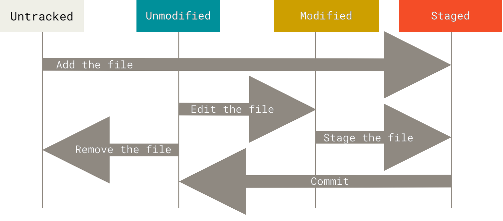

# Intorduction and Tutorial to Git, and Github

See the [git website](https://git-scm.com/) and [git book](https://git-scm.com/book/en/v2) for source material

## What is Git? ([1.2](https://git-scm.com/book/en/v2/Getting-Started-About-Version-Control)/[1.3](https://git-scm.com/book/en/v2/Getting-Started-What-is-Git%3F))
 
Git is a *version control system*, which is 'a system that records changes to a file or set of files over time so that you can recall specific versions later.' This becomes essential when people are collaboratively developing a codebase because it allows for easily maintaining an shared version between collaborators, and provides tools for merging different versions of code. Today, git is by far the most used version control system.

Git thinks of its data like a series of snapshots of a miniature filesystem. With Git, every time you *commit*, or save the state of your project, Git basically takes a picture of what all your files look like at that moment and stores a reference to that snapshot.

**Git vs Github**: Github is a platform that allows users to create, store, manage, and share their code *using git*. Lets compare the two: Git is a program that anyone can run on their computer, allowing users to manage a *repository*, or a set of files. Github is a service provided via the internet that allows users to store and share Git repositories. Git is the engine for the version control, and Github is the cloud service for Git repositories.

## Running Git ([1.4](https://git-scm.com/book/en/v2/Getting-Started-The-Command-Line)/[1.5](https://git-scm.com/book/en/v2/Getting-Started-Installing-Git))

Git is an appliation. The most classic way to run it is through its command-line-interface, or CLI. There also exist many graphical user interfaces, such as a vscode extension and the github desktop app. In this tutorial we'll learn a set of git functions in the CLI, which is how all things git work behind the scenes.

## Git Repositories ([2.1](https://git-scm.com/book/en/v2/Git-Basics-Getting-a-Git-Repository))

A project that is managed by Git is called a *repository*, or a *repo*. 

You typically obtain a Git repository in one of two ways:
- You can take a local directory that is currently not under version control, and turn it into a Git repository, or
- You can *clone* (copy a remote repo from the internet onto your computer) an existing Git repository from elsewhere.

To turn a local directory into a Git repo you must
- navigate to the desired folder
- run this:
```bash
$ git init
```
To clone a repo you must
- navigate to the desired parent folder
- run this:
```bash
$ git clone https://[INSERT LINK TO REPO] 
```

All git repos will have a folder called `.git` which holds all the information about past snapshots. 

## Following along with this Tutorial
To follow along with this tutorial, you should start your own blank GitHub repo. We will be copying some file from `file_versions/` folder from this repo. I recommend copy-pasting the code when neessary. To learn how to start your own GitHub repo, continure reading.

## SSH access to Github
To access GitHub there are a couple different methods. I like using SSH, which allows you to *push* and *pull* code using Git commands. For a full guide, see [GitHub's guide to Authentication](https://docs.github.com/en/authentication/keeping-your-account-and-data-secure/about-authentication-to-github#authenticating-with-the-command-line).

### Excercise
We will start by creating and uploading an SSH key to GitHub. This must be done for each computer that accesses your GitHub account.

```bash
# generate an ssh key if needed. Use the email associated with your GitHub account email
ssh-keygen -t ed25519 -C "your_email@example.com"
# copy ssh public key to clipboard
pbcopy < ~/.ssh/id_ed25519.pub
```
Now, add the ssh key to your github account. Go to account->setting->ssh keys. Then paste the public key.

Test github ssh with the following command:
```bash
ssh -T git@github.com
```
Next, create an empty repository on github.com. You can read more detailed explination here: [Adding a local repository to GitHub using Git](https://docs.github.com/en/migrations/importing-source-code/using-the-command-line-to-import-source-code/adding-locally-hosted-code-to-github#adding-a-local-repository-to-github-using-git)
```bash 
# if you want to push an existing local git repo
git remote add origin git@github.com:[username]/[repo_name]
git push -u origin main
# note, -u sets the default upstream branch

# or if you are staring the repo from scratch, use git clone to automatically set the upstream remote.
git clone git@github.com:[username]/[repo_name]

# to check that things are set up properly, run this
git remote show origin
```


## Recording Changes to a Repository ([2.2](https://git-scm.com/book/en/v2/Git-Basics-Recording-Changes-to-the-Repository))

Git stores snapshots of all tracked files in a repository. These snapshots are called *commits*. A commit refers to a specific state of every *tracked* file. Files can also be *untracked*, in which case Git basically leaves them alone.

To make a commit, you must first *add* the file to the *staging area*, and then commit the staged changes. By first building up a set of changes in the staging area, users have greater control over the state of a commit. 

Files can be in one of 4 states, Untracked, Unmodified, Modified, or Staged. 
To view the state of every file, run
```bash
$ git status
```
### Excercise 
Lets make a file to track with git. Create a new file named `[your name]_git_tree.py`
Copy `draw_git_tree_v1.py`


## Forking and Pull Requests


